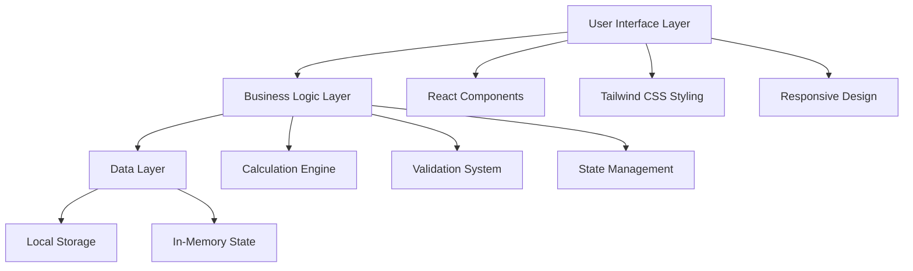
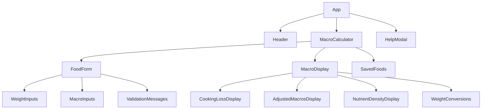

# Design Document

## Overview

The Precision Macro & Cooking Loss Calculator is a React-based single-page application that provides real-time macronutrient calculations adjusted for cooking-induced weight changes. The application uses scientific principles of nutrient density to maintain calculation accuracy while providing an intuitive user experience across all devices.

## Architecture

### High-Level Architecture



### Component Architecture



## Components and Interfaces

### Core Components

#### 1. App Component

- **Purpose**: Main application container and state orchestration
- **Props**: None
- **State**: Global application state, modal visibility
- **Responsibilities**: Route management, global error handling, theme management

#### 2. MacroCalculator Component

- **Purpose**: Main calculator logic and state management
- **Props**: None
- **State**: Food data, calculation results, saved foods
- **Responsibilities**: Coordinate calculations, manage form state, handle data persistence

#### 3. FoodForm Component

- **Purpose**: User input collection and validation
- **Props**:
  ```typescript
  interface FoodFormProps {
    foodData: FoodData;
    onFoodDataChange: (data: FoodData) => void;
    validationErrors: ValidationErrors;
  }
  ```
- **Responsibilities**: Input handling, real-time validation, unit selection

#### 4. MacroDisplay Component

- **Purpose**: Display calculation results and conversions
- **Props**:
  ```typescript
  interface MacroDisplayProps {
    rawData: FoodData;
    calculationResults: CalculationResults;
    isCalculationValid: boolean;
  }
  ```
- **Responsibilities**: Format and display results, show weight conversions

#### 5. SavedFoods Component

- **Purpose**: Manage saved food items and cooking ratios
- **Props**:
  ```typescript
  interface SavedFoodsProps {
    savedFoods: SavedFood[];
    onSaveFood: (food: SavedFood) => void;
    onLoadFood: (food: SavedFood) => void;
    onDeleteFood: (id: string) => void;
  }
  ```
- **Responsibilities**: CRUD operations for saved foods, localStorage management

### Utility Modules

#### 1. Calculation Engine (`src/lib/calculations.ts`)

```typescript
export interface CalculationFunctions {
  convertWeight(
    value: number,
    fromUnit: WeightUnit,
    toUnit: WeightUnit
  ): number;
  calculateCookingLoss(rawWeight: number, cookedWeight: number): number;
  adjustMacrosForCooking(
    rawMacros: MacroData,
    rawWeight: number,
    cookedWeight: number
  ): MacroData;
  calculateNutrientDensity(macros: MacroData, weight: number): MacroData;
  getAllWeightConversions(weight: number, unit: WeightUnit): WeightConversions;
}
```

#### 2. Validation System (`src/lib/validations.ts`)

```typescript
export interface ValidationFunctions {
  validateFoodData(data: FoodData): ValidationErrors;
  validateWeight(weight: number, fieldName: string): string | null;
  validateMacroValue(value: number, fieldName: string): string | null;
  validateCookingRatio(rawWeight: number, cookedWeight: number): string | null;
}
```

## Data Models

### Core Data Types

```typescript
export type WeightUnit = "g" | "oz" | "lb" | "kg";

export interface FoodData {
  name: string;
  rawWeight: number;
  rawWeightUnit: WeightUnit;
  cookedWeight: number;
  cookedWeightUnit: WeightUnit;
  rawMacros: MacroData;
}

export interface MacroData {
  calories: number;
  protein: number;
  carbohydrates: number;
  fat: number;
  fiber: number;
}

export interface CalculationResults {
  cookingLossPercentage: number;
  adjustedMacros: MacroData;
  rawDensityPer100g: MacroData;
  cookedDensityPer100g: MacroData;
  weightConversions: {
    raw: WeightConversions;
    cooked: WeightConversions;
  };
}

export interface WeightConversions {
  grams: number;
  ounces: number;
  pounds: number;
  kilograms: number;
}

export interface SavedFood {
  id: string;
  name: string;
  cookingRatio: number; // cookedWeight / rawWeight
  dateAdded: number;
}

export interface ValidationErrors {
  [fieldName: string]: string | null;
}
```

### Weight Conversion Constants

```typescript
export const WEIGHT_CONVERSIONS = {
  GRAMS_TO_OUNCES: 0.035274,
  OUNCES_TO_GRAMS: 28.3495,
  GRAMS_TO_POUNDS: 0.00220462,
  POUNDS_TO_GRAMS: 453.592,
  GRAMS_TO_KILOGRAMS: 0.001,
  KILOGRAMS_TO_GRAMS: 1000,
} as const;
```

## Error Handling

### Input Validation Strategy

1. **Real-time Validation**: Validate inputs as user types with debouncing
2. **Visual Feedback**: Highlight invalid fields with red borders and error messages
3. **Graceful Degradation**: Show partial results when possible, disable invalid operations

### Error Types and Messages

```typescript
export const ERROR_MESSAGES = {
  REQUIRED_FIELD: "This field is required",
  POSITIVE_NUMBER_ONLY: "Please enter a positive number",
  COOKED_EXCEEDS_RAW: "Cooked weight cannot be greater than raw weight",
  INVALID_NUMBER: "Please enter a valid number",
  STORAGE_ERROR: "Unable to save data. Please try again.",
} as const;
```

### Error Boundaries

- Implement React Error Boundaries to catch component-level errors
- Provide fallback UI with option to reset application state
- Log errors for debugging while maintaining user experience

## Testing Strategy

### Unit Testing

#### Calculation Functions

```typescript
describe("Weight Conversions", () => {
  test("converts grams to ounces correctly", () => {
    expect(convertWeight(100, "g", "oz")).toBeCloseTo(3.5274, 4);
  });

  test("converts pounds to kilograms correctly", () => {
    expect(convertWeight(2.2, "lb", "kg")).toBeCloseTo(1, 2);
  });
});

describe("Macro Calculations", () => {
  test("calculates cooking loss percentage", () => {
    expect(calculateCookingLoss(200, 150)).toBe(25);
  });

  test("adjusts macros for cooking correctly", () => {
    const rawMacros = {
      calories: 220,
      protein: 41,
      carbohydrates: 0,
      fat: 5,
      fiber: 0,
    };
    const adjusted = adjustMacrosForCooking(rawMacros, 200, 150);
    expect(adjusted.calories).toBe(165);
    expect(adjusted.protein).toBe(30.75);
  });
});
```

#### Validation Functions

```typescript
describe("Input Validation", () => {
  test("validates positive numbers", () => {
    expect(validateWeight(-5, "weight")).toBe("Please enter a positive number");
    expect(validateWeight(0, "weight")).toBe("Please enter a positive number");
    expect(validateWeight(10, "weight")).toBeNull();
  });

  test("validates cooking ratio", () => {
    expect(validateCookingRatio(100, 120)).toBe(
      "Cooked weight cannot be greater than raw weight"
    );
    expect(validateCookingRatio(100, 80)).toBeNull();
  });
});
```

### Component Testing

#### Form Component Tests

```typescript
describe('FoodForm Component', () => {
  test('updates food data on input change', () => {
    const mockOnChange = jest.fn();
    render(<FoodForm foodData={mockData} onFoodDataChange={mockOnChange} />);

    fireEvent.change(screen.getByLabelText('Food Name'), { target: { value: 'Chicken' } });
    expect(mockOnChange).toHaveBeenCalledWith(expect.objectContaining({ name: 'Chicken' }));
  });

  test('displays validation errors', () => {
    const errors = { rawWeight: 'Please enter a positive number' };
    render(<FoodForm validationErrors={errors} />);

    expect(screen.getByText('Please enter a positive number')).toBeInTheDocument();
  });
});
```

### Integration Testing

#### End-to-End Calculation Flow

```typescript
describe('Calculator Integration', () => {
  test('complete calculation workflow', () => {
    render(<MacroCalculator />);

    // Fill in form data
    fireEvent.change(screen.getByLabelText('Food Name'), { target: { value: 'Test Food' } });
    fireEvent.change(screen.getByLabelText('Raw Weight'), { target: { value: '200' } });
    fireEvent.change(screen.getByLabelText('Cooked Weight'), { target: { value: '150' } });

    // Verify calculations appear
    expect(screen.getByText('Cooking Loss: 25.00%')).toBeInTheDocument();
  });
});
```

### Performance Testing

- Test calculation performance with large numbers
- Verify real-time updates don't cause performance issues
- Test localStorage operations with large datasets
- Validate responsive design across device sizes

## Implementation Notes

### State Management Strategy

Use React hooks for state management:

- `useState` for component-level state
- `useEffect` for side effects and data persistence
- `useCallback` for memoizing calculation functions
- `useMemo` for expensive calculations

### Accessibility Considerations

- Semantic HTML elements for screen readers
- ARIA labels for form inputs and results
- Keyboard navigation support
- High contrast color scheme compliance
- Focus management for modal interactions

### Performance Optimizations

- Debounce input changes to prevent excessive calculations
- Memoize expensive calculation results
- Lazy load help documentation content
- Optimize re-renders with React.memo where appropriate

### Browser Compatibility

- Support modern browsers (Chrome 90+, Firefox 88+, Safari 14+, Edge 90+)
- Graceful degradation for older browsers
- Progressive enhancement for advanced features
- localStorage fallback for unsupported browsers
